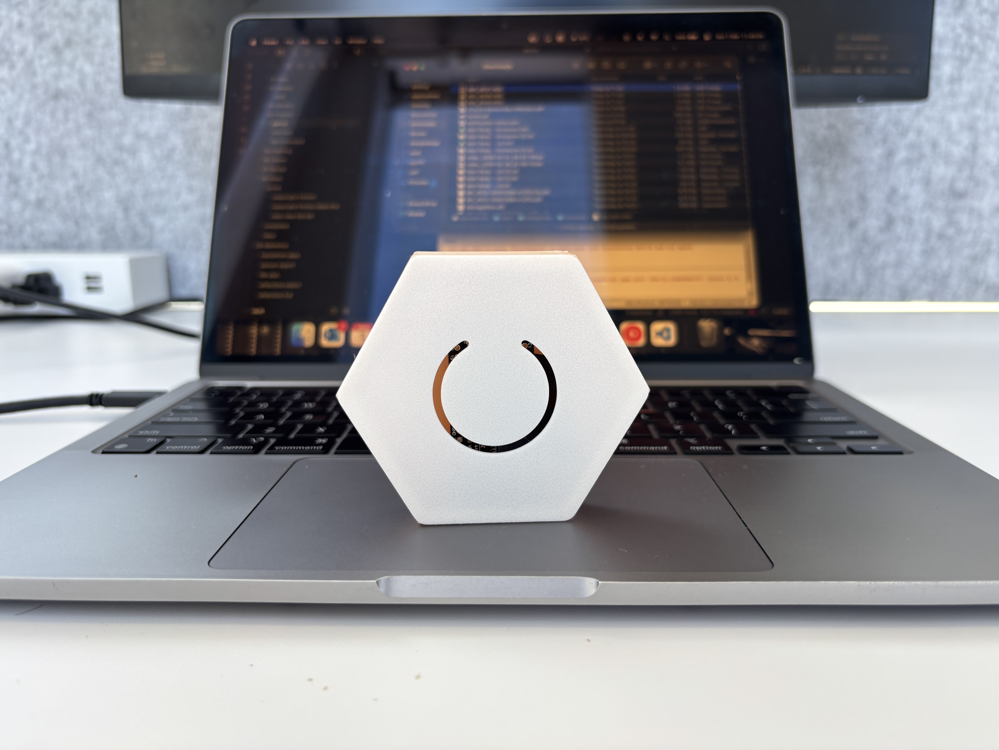

# Glance

> Your life, at a glance.

Glance is a physical display of the things that matter to you — friends, habits, practices. Each one is a hexagonal puck on your wall or desk. Each one glows. Each one has a heartbeat.

Let it slip, the pulse slows. Ignore it long enough, it flatlines. Press it when you've done the thing, it comes back to life.

No notifications. No streaks. No score. Just a honeycomb that goes quiet when your life does.

## How it works

Each node pulses at a rate tied to how long it's been since you last pressed it. Fresh: full brightness, ~60bpm. A few days gone: dimmer, slower. Too long: dark. The label disappears with the light.

Press the node. It flares back on.

Decay speed is configurable per node — a daily habit fades faster than a weekly one.

## The hardware

Nodes are identical hexagonal pucks, about 70mm across. They snap together magnetically, and power runs between them through contacts in the edges. One USB-C cable in, the rest of the cluster follows.

Works mounted on a wall (a metal backing plate, nodes snap on) or on a desk (a weighted angled stand). Same nodes either way, just a different base.

The goal is that it looks like a piece of art before it looks like a gadget.

## Status

Early stage. Currently breadboarding the firmware and interaction feel before moving to a custom PCB.
